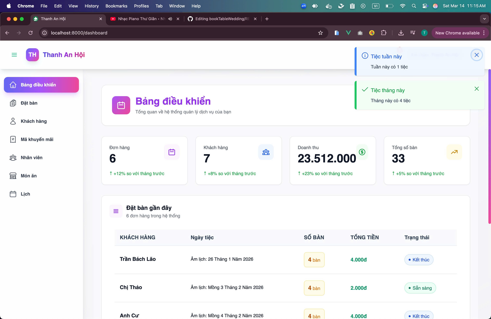
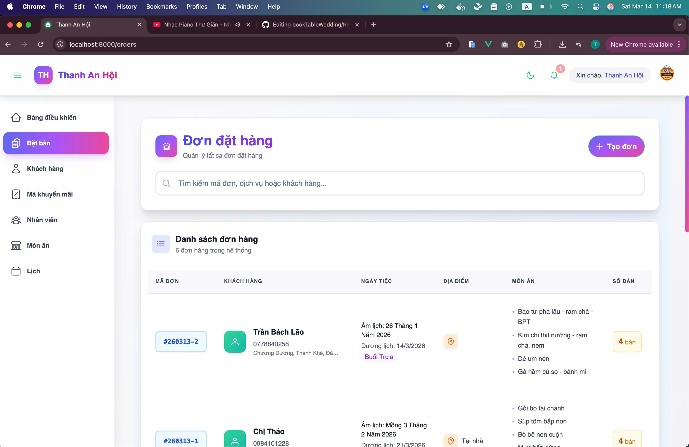
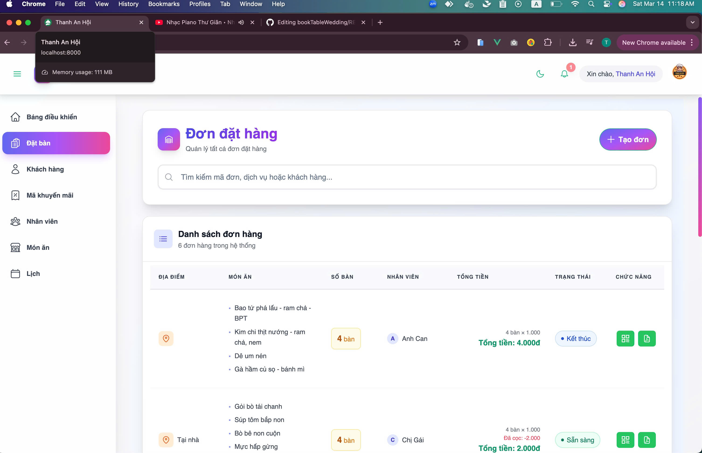
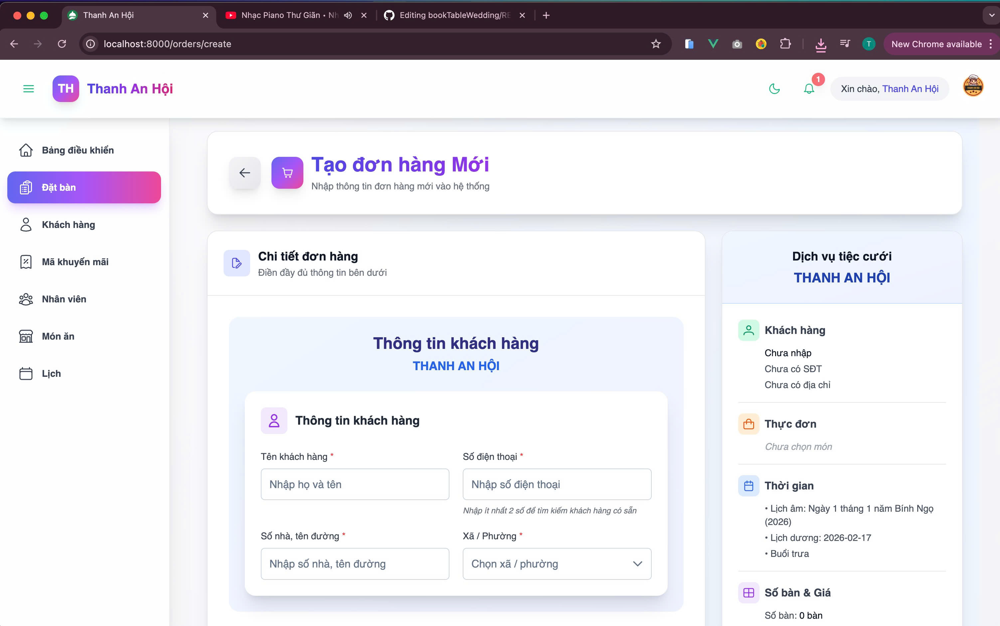
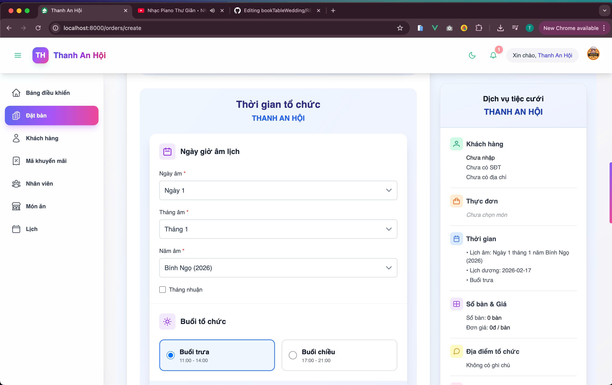
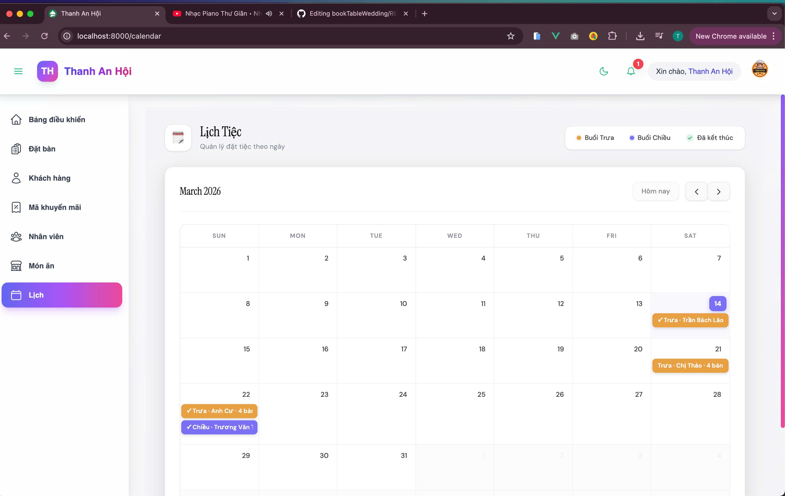
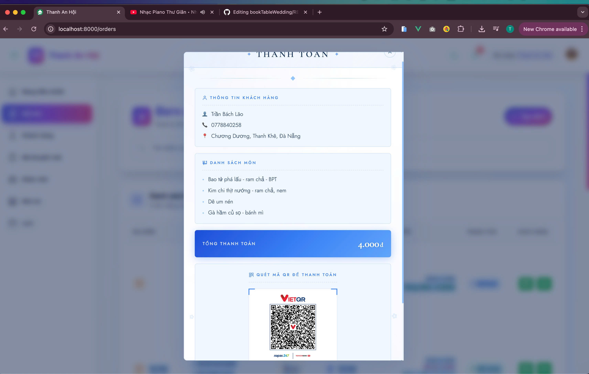
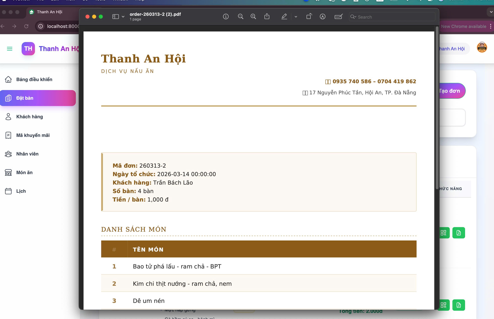

# Wedding Banquet Reservation System

A full-featured web application for managing wedding banquet reservations, helping staff easily manage orders, schedules, and event information.

---

## 🚀 Features

- Vietnamese **Lunar Calendar integration** for event date selection  
- **Solar date conversion** from lunar dates  
- **Event Calendar** for managing wedding schedules  
- **Morning / Afternoon session selection**  
- **Customer information management** (name, phone, address)  
- **Dynamic table number & pricing calculation**  
- **QR Code bill preview** for quick order access  
- **PDF invoice export** for printing and sharing  
- Order status tracking and staff assignment  

---

## 🛠 Tech Stack

Frontend
- Vue.js
- PrimeVue
- TailwindCSS

Backend
- Laravel
- RESTful API

Database
- MySQL

Tools
- Git
- Postman

---

## 📸 Screenshots

### Dashboard


### Order List



### Create Order 




### Event Calendar


### QR Bill Preview


### PDF Export


---

## ⚙️ Installation

Clone project

```bash
git clone https://github.com/your-username/project-name.git
